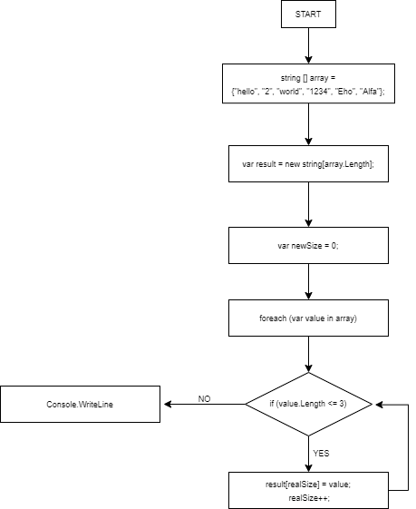

# Контрольная работа

### **Задача**: 
Написать программу, которая из имеющегося массива строк формирует массив из строк, длина которых меньше либо равна 3 символам. Первоначальный массив можно ввести с клавиатуры, либо сгенерировать случайным образом. При решении не рекомендуется пользоваться коллекциями, лучше обойтись исключительно массивами.

**Примеры**:

   * ["hello", "2", "world", ":-)"] ---> ["2", ":-)"]
   * ["1234", "1567", "-2", "computer science"] ---> ["-2"]
   * ["Russia", "Denmark", "Kazan"] ---> []

# Решение

### 1. Для начала рисуем блок-схему

### 2. Пишем код на языке C# в Visual Studio Code

   **1. Задаем метод создания начального массива**

    string[] array 

   **2. Заполняем массив**

    "hello",
    "2",
    "world",
    "1234",
    "Eho",
    "Alfa"

   **3. Создаем новую переменную, в которую записывается длина массива**

    var result = new string[array.Length]

   **4. Создаем счетчик**

    var newSize = 0

   **5. Задаем цикл**

    foreach (var value in array)

   **6. Задаем условие для цикла**

    if (value.Length <= 3)
    {
        result[newSize] = value;
        newSize++;
    }

   **7. Выводим результат на экран**

    Console.WriteLine(string.Join(Environment.NewLine, result, 0, newSize));
